# Pulseway Traffic Intelligence

An end-to-end traffic video analytics platform. Upload road footage, process it through a headless computer-vision pipeline, and review vehicle flow, congestion forecasts, lane pressure, stalled-vehicle alerts, signal recommendations, annotated video, heatmaps, and a top-down projection in a polished dashboard.

## What is implemented

- FastAPI upload → background analysis → results workflow with OpenAPI docs at `/docs`
- SQLite job state and time-series metadata, plus downloadable CSV per job
- YOLO detection when Ultralytics is available; automatic OpenCV motion-detection fallback
- Lightweight Kalman/IOU-style identity tracking (accurately labelled; no DeepSORT claim)
- Line-crossing counts, lane statistics, density + speed congestion scoring
- Explainable rolling linear forecast for the next 1, 3, and 5 minutes
- Stalled-vehicle detection, pedestrian head-region blur, adaptive green-time recommendation
- Annotated MP4, density heatmap, and explicitly labelled top-down projection
- Responsive React dashboard with upload, processing, and results states
- Unit/API tests and Docker Compose packaging

# 🏗️ SYSTEM ARCHITECTURE

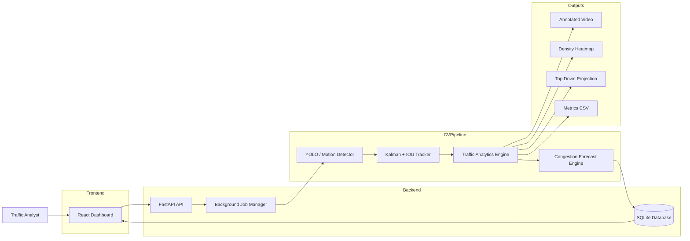

---

# 🔄 END-TO-END PROCESSING PIPELINE

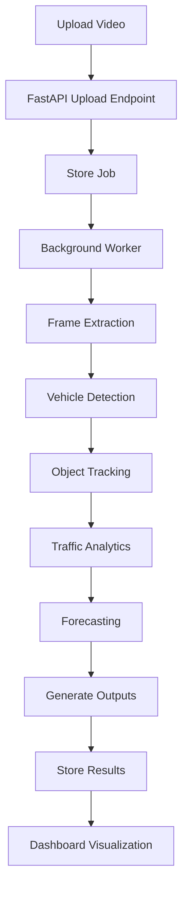

---

# ⚡ API WORKFLOW SEQUENCE

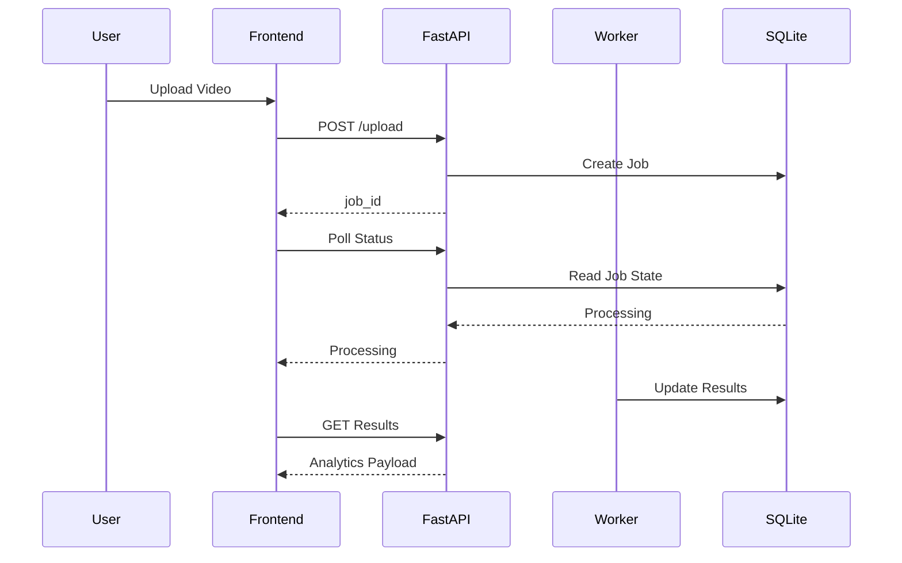

---

# 🚗 DETECTION & TRACKING PIPELINE

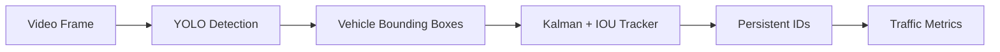

---

# 📊 TRAFFIC ANALYTICS ENGINE

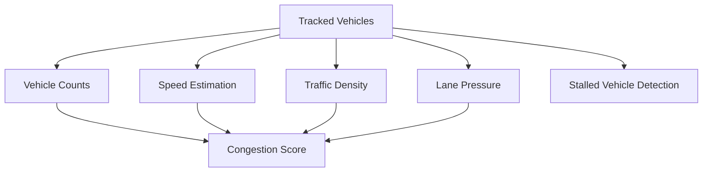

---

# 📈 CONGESTION FORECASTING PIPELINE

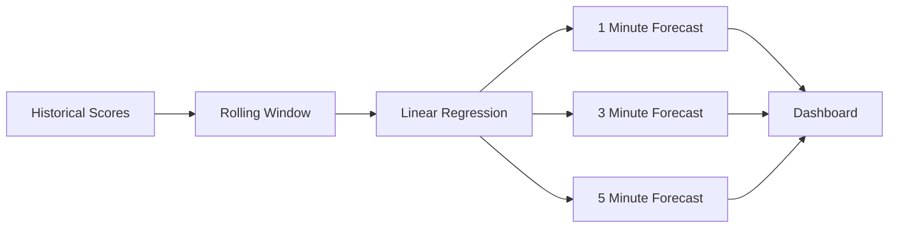

---

# 🚨 INCIDENT DETECTION WORKFLOW

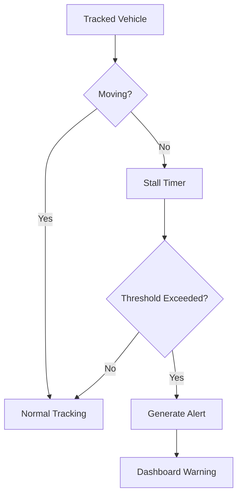

---

# 📂 OUTPUT GENERATION PIPELINE

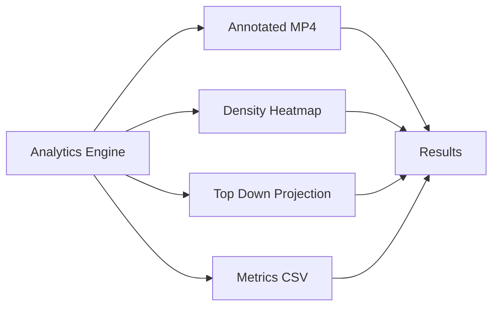

---

# 🗄️ DATABASE & JOB STATE FLOW

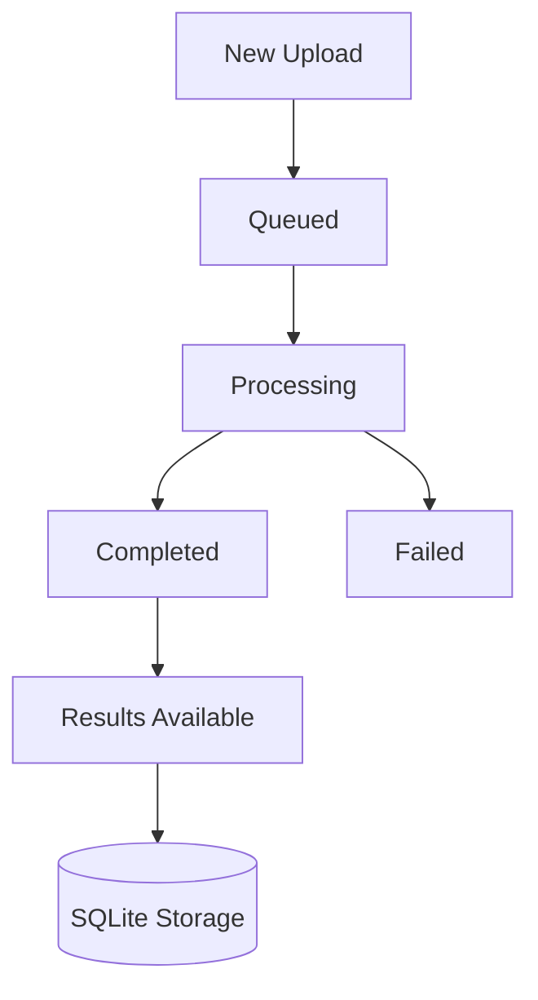

---

# 📂 PROJECT STRUCTURE ARCHITECTURE

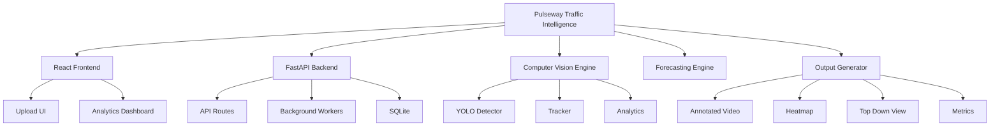

---

# 🚀 PRODUCTION-SCALE ARCHITECTURE

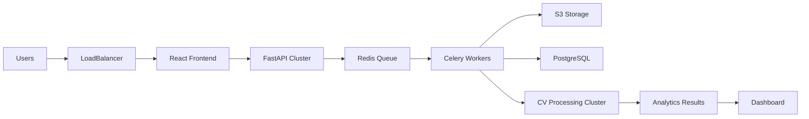


## Local development

Requirements: Python 3.10+, Node.js 20+, and an OpenCV-supported video codec.

```powershell
cd backend
python -m venv .venv
.venv\Scripts\Activate.ps1
pip install -r requirements.txt
uvicorn app.main:app --reload
```

In a second terminal:

```powershell
cd frontend
npm install
npm run dev
```

Open `http://localhost:5173`. The Vite server proxies `/api` to `http://localhost:8000`. API documentation is at `http://localhost:8000/docs`.

To run without downloading/loading YOLO weights, set `$env:TRAFFIC_DETECTOR='motion'` before starting the API. `auto` is the default and falls back to motion detection if YOLO cannot initialize.

## CLI

The processing engine is display-free and can be used without the web app:

```powershell
cd backend
python cli.py ..\samples\sample-traffic.mp4 --output output --detector motion
```

## Tests and builds

```powershell
cd backend
pytest -q

cd ..\frontend
npm run build
```

## Docker

```powershell
docker compose up --build
```

Open `http://localhost:8080` (dashboard) or `http://localhost:8000/docs` (API).

## API

| Method | Path | Purpose |
|---|---|---|
| `POST` | `/upload` | Validate and store a video; returns `job_id` |
| `GET` | `/jobs/{id}/status` | Poll queued/processing/done/failed state |
| `GET` | `/jobs/{id}/results` | Full analytics payload |
| `GET` | `/jobs/{id}/video` | Annotated MP4 |
| `GET` | `/jobs/{id}/heatmap` | Density image |
| `GET` | `/jobs/{id}/bev` | Top-down projection image |
| `GET` | `/jobs/{id}/metrics` | Per-interval CSV |

## Measurement caveats

Speed is an estimate based on a configurable meters-per-pixel assumption. Calibrate each camera with known road geometry before treating it as a measured physical speed. The top-down image is a scaled spatial projection, not a perspective-corrected homography. Congestion prediction is a short-horizon extrapolation of observed score trends; it is deliberately explainable and does not claim long-term forecasting accuracy.

For production concurrency, replace in-process background tasks with a durable queue such as Celery/Redis and store media in object storage. The current architecture is intentionally suited to a solo/academic demo deployment.

See [`samples/sample-results.json`](samples/sample-results.json) for an example API response.
